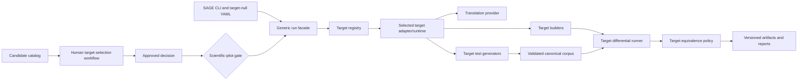

# Architecture

## System boundaries

SAGE separates target-independent orchestration from target implementations. The public `sage`
package and `sage.core` facade know only configuration, run mode, selection validation,
and the target registry. They load adapters by registered module path. They do not import target-specific
builders, input classes, reference equations or numerical policies.

All implementation modules live under `sage`. `sage.core.orchestrator` provides the generic run
facade, `sage.orchestrator` provides shared report re-rendering, and
`sage.einsums` owns Einsums execution. The CLI and registry import these modules directly.

Platform-demo mode bypasses the human selection gate but is labeled as a demonstration in the run
manifest. Scientific-pilot mode validates a supplied target-bound `APPROVED` decision before the
target runtime is constructed.

## Record types

- A `TargetCandidate` and `CandidateAssessment` capture what is known and unknown about a possible
  target. Candidate state is descriptive.
- A `TargetRecommendation` is an authored proposal with rationale and evidence. SAGE defines the
  type but creates no recommendation automatically.
- A `SelectionDecision` records a human approval, approver, time, rationale, and evidence. Only this
  record can open the scientific-pilot gate.
- A `RunManifest` records target candidate, run mode, and selection decision separately from code
  provenance and outcomes.

## Responsibilities

- `sage.core`: mode validation and dynamic dispatch; target-independent.
- `targets/catalog.py`: candidate schemas and YAML loading.
- `targets/selection.py`: decision validation and optional local selection-state recording.
- `targets/registry.py`: target IDs mapped to lazily loaded adapters, runtimes, and demo profiles.
- Target adapters: preparation, scientific domain, canonical format, builders, references, generators,
  numerical policy, replay, and target-specific reporting detail.
- `einsums/`: bounded tensor input protocol, independent NumPy policy, and CPU tensor runtime.
  The Einsums C++ reference uses the pinned upstream library in Docker; independent Rust and
  C++20 candidates run natively. Full-library profiles capture multi-file implementations and
  exercise their actual Python entrypoints. Campaigns validate only new SymSan-generated inputs;
  authenticated API replays are recorded separately. Bootstrap seeds are not evidence.
- Providers: translation only; they never select targets or determine equivalence.
- Reports/provenance: immutable evidence views, including compatibility fields for old manifests.

## Trust boundaries and failure handling

Candidate facts may be incomplete; null and empty values remain unknown rather than inferred. A
catalog state, comparison table, or recommendation cannot impersonate approval. A malformed, draft,
wrong-target, or approver-less decision is rejected before side effects.

Upstream source, model output, native binaries, and SymSan bytes are untrusted. Native execution is
out of process with resource limits; SymSan is containerized with networking disabled. Build failures,
invalid inputs, crashes, timeouts, numerical differences, structural differences, and reference
disagreements remain distinct. Every behavioral discrepancy requires clean replay.

## Compatibility

Configuration schemas 1.0 and 1.1 remain readable. Schema 1.1 permits `target: null`
and is the default. Older Einsums manifests receive target and run-mode defaults
in memory, without rewriting evidence files. The package and command are `sage`,
provider settings use the `SAGE_` prefix, and caches use `.sage/`.
The retired catalog ID `psi4-module` resolves to the canonical `einsums` candidate so earlier draft
commands remain readable; catalog listing and all new records use `einsums`.

## Extension points

Adding a target requires a candidate record first, then a registry entry only after its adapter and
platform-demo profile exist. Each adapter owns its input schema, scientific references, native build
commands, test generators, equivalence policy, and limitations. Translation providers and concolic
engines remain replaceable interfaces. Unsupported candidates stay visible without pretending an
adapter or scientific approval exists.
