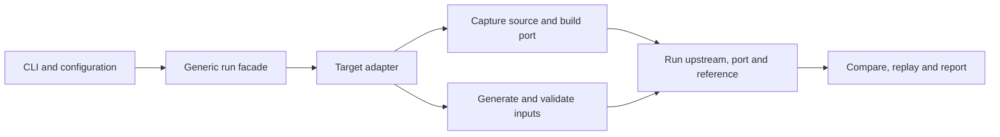

# Development

Start with [Getting started](getting-started.md) if you only want to use the tools.
This guide covers the code structure, contributor checks and target workflow.

- [Architecture](#architecture) and [language choices](#why-python-rust-and-c).
- [Development setup](#development-setup) and [repository workflow](#repository-workflow).
- [Target selection](#target-selection) and [adding a target](#add-a-target).
- [Execution and source handling](#execution-and-source-handling).

## Architecture

SAGE's Python package coordinates configuration, native builds, generation,
comparisons and reports. Each target owns its scientific inputs and policies.
The Rust and C++ ports perform numerical work; NumPy supplies an independent
reference during validation.



| Location | Responsibility |
|---|---|
| `sage/cli.py`, `sage/core/` | Commands, run-mode checks and target dispatch |
| `sage/targets/` | Candidate catalog, selection decisions and lazy adapter registry |
| `sage/einsums/` | Einsums input domains, runtime, coverage and numerical policy |
| `sage/generators/` | Bounded SymSan generation with a target-specific decoder |
| `sage/translators/` | Translation-provider contracts |
| `sage/verification/`, `verification/` | Proof runners and harnesses |
| `ports/einsums-rs/`, `ports/einsums-cpp/` | Independent native implementations and Python packages |
| `configs/`, `containers/` | Campaign settings, translation prompts and reproducible build environments |
| `targets/` | Target catalog and optional selection/recommendation templates |
| `tools/` | Setup, builds and API replay; `verification/` contains proof-summary and adapter-check helpers |
| `artifacts/` | Maintained presentation files and curated proof summaries |

`sage.core.orchestrator.SageRun` is the generic facade; `sage.orchestrator` provides
shared report re-rendering. Target-specific builders, input types and equations
belong in the adapter, not the generic core. Adapters load through registered
module paths. Schemas 1.0/1.1 remain readable; old supported Einsums records get
compatibility defaults in memory without rewriting original evidence.

## Why Python, Rust and C++

Python makes configuration, provider integration, NumPy references and reporting
straightforward. It coordinates native work rather than replacing scientific kernels.
Rust was the first translation language because ownership and types help express
safe storage and interfaces. C++20 supplies a separate implementation close to the
source language, with standard ownership facilities and Eigen-backed algorithms.
Neither language's type system guarantees numerical compatibility.

The ports have separate source, build and evidence identities. The Python interface
code has shared origins, but each package loads its own native backend. Rust and
C++ numerical dependencies are described in the [reference](reference.md#implementation-details).
Models may provide code or explanations; executions and recorded policies determine
comparison outcomes. Model output cannot change tolerances or suppress findings.

## Development setup

Install Python 3.11+, uv, Git, Rust 1.84+, a C compiler and CMake. Full C++ integration
also requires a C++20 compiler, Eigen, nlohmann JSON and HDF5. Follow the
[C++ dependency instructions](../ports/einsums-cpp/README.md#build). Docker and
proof tooling are needed only for actual generation/proof campaigns.

```sh
uv sync --all-extras --locked
cargo fetch --locked --manifest-path ports/einsums-rs/Cargo.toml
make check
```

`make check` runs formatting/lint, strict typing, Python unit/integration tests and
Rust checks. It needs the native dependencies, but no Docker or API credentials.
Some orchestration tests stub generation and container responses. Those stubs and
native fixtures are regression tests, not scientific campaign evidence.

Useful narrower checks:

```sh
make test
make test-integration
make lint
make test-rust
cmake -S ports/einsums-cpp -B .sage/cpp20-build -DCMAKE_BUILD_TYPE=Release
cmake --build .sage/cpp20-build -j 2
ctest --test-dir .sage/cpp20-build --output-on-failure
```

The native checks cover residuals/reconstruction, dtype and shape contracts,
strided aliases/owner lifetime, mutation/error atomicity, HDF5 interoperability,
runtime behavior and packaging. Numerical tests account for nonunique eigenvector
and factorization bases. Literal compatibility differences stay visible.

## Repository workflow

Track source, tests, configurations, lockfiles, target records, proof harnesses,
curated summaries and final slides. `.gitignore` excludes `runs/`, `.sage/`, virtual
environments, Cargo/CMake output, wheels, caches, private slide builds and credentials.
Keep `.env.example`, `uv.lock` and `Cargo.lock`; preserve upstream source licenses
when distributing run bundles. `.gitattributes` keeps source/harness line endings
consistent and presentations binary.

Before a commit, check both content and the file list:

```sh
git status --short
git add --dry-run .
git diff --check
```

Keep maintained presentation filenames in `artifacts/sage-slides/output/` undated.
Do not replace immutable run evidence with a newer result under the same identity.
Update [Current status](status.md) when results change, and label historical counts
as historical rather than mixing milestones.

`uv run sage clean --run <run-id>` deletes one validated direct child of `runs/`
containing a manifest. It does not remove caches, Docker images or external backups.

## Target selection

A catalog **candidate** records facts and open questions. A **recommendation** is a
separate authored proposal. An **approved selection** records a human decision.
Only the last authorizes `scientific-pilot` mode; even a candidate marked `SELECTED`
cannot replace it. Technical readiness and scientific priority remain separate.

Einsums is implemented but `UNDER_ASSESSMENT` for scientific selection. Other
potential targets have catalog records only. Candidate states are `PROPOSED`,
`UNDER_ASSESSMENT`, `FEASIBLE`, `SELECTED`, `DEFERRED` and `PILOT_COMPLETE`.
`psi4-module` is a deprecated lookup alias for `einsums`, not a second target.

```sh
uv run sage target list
uv run sage target show einsums
uv run sage target assess einsums
uv run sage target compare <target-a> <target-b>
uv run sage target selection-status
```

Comparison displays sourced fields without scores, ranking or an inferred
recommendation. Leave unknown priority, availability and responsibilities explicit.
Before recommending a pilot, confirm the scientific use case, included APIs and
platforms, independent references/tolerances, intentional compatibility changes,
reviewers and actual availability, acceptance evidence and publication constraints.
For Einsums, downstream Psi4 workflows and the backend/platform matrix need agreement.

A human decision-maker fills [the selection template](../targets/templates/selection-template.yaml)
with schema 1.0, kind `target-selection`, matching target, `APPROVED` status,
decision ID, approver, timestamp, rationale and evidence. Then:

```sh
uv run sage target select einsums --decision targets/records/<approved-decision>.yaml
uv run sage run --target einsums --mode scientific-pilot \
  --selection targets/records/<approved-decision>.yaml --provider offline
```

Keep authored decisions or recommendations in `targets/records/` when needed;
create that directory when recording an actual proposal or decision. The templates
live in `targets/templates/`. No authored records are shipped by default.

The selection command records the decision/hash in `.sage/selection.json` without
editing the candidate. Pilot execution validates approval again before constructing
the runtime. Platform demonstrations need no selection and remain labeled demos.
Approval cannot make an unimplemented adapter executable.

## Add a target

1. Copy [the candidate template](../targets/candidates/template.yaml), recording sourced facts and unresolved fields.
2. Define a bounded scientific contract: pin/license, canonical inputs, observables, independent references, ordering/layout, invalid cases and numerical policies.
3. Implement preparation, source capture, translation selection, native builds, instrumentation, input validation and allocation bounds in target-owned code.
4. Supply bootstrap inputs, a SymSan decoder/generator, reference runners, comparison policy, discrepancy replay and explicit limitations. Seeds must never become fallback validation evidence.
5. Add a platform-demo configuration and tests for parsing, bounds, generation failure, native comparisons and deliberate semantic faults. Register the adapter/runtime paths only when executable.

Keep `configs/sage.yaml` target-null. Unsupported adapters/providers must fail
explicitly rather than substitute another target or implementation. Scientific
pilot approval remains the separate workflow above.

## Execution and source handling

Treat upstream source, provider code and generated bytes as untrusted. Native
execution runs out of process with resource/time/output bounds. SymSan runs use
network-disabled containers and required run-directory mounts. Invalid inputs are
quarantined; failures, crashes, timeouts and numerical differences remain distinct.
Docker limits accidental impact but is not a hardened boundary for hostile code;
such workloads need an isolated worker or VM.

Builds/source preparation may access the network. An explicitly selected network
provider receives the bounded source unit and prompt. Credentials stay out of
manifests; source comments and provider responses cannot control execution policy.
Runs can contain source, prompts, paths and provider metadata. Apply the source
license and organizational sharing rules when exporting them. Base-image/package
repositories can move even when source pins are fixed; each run records its actual
image identity.
